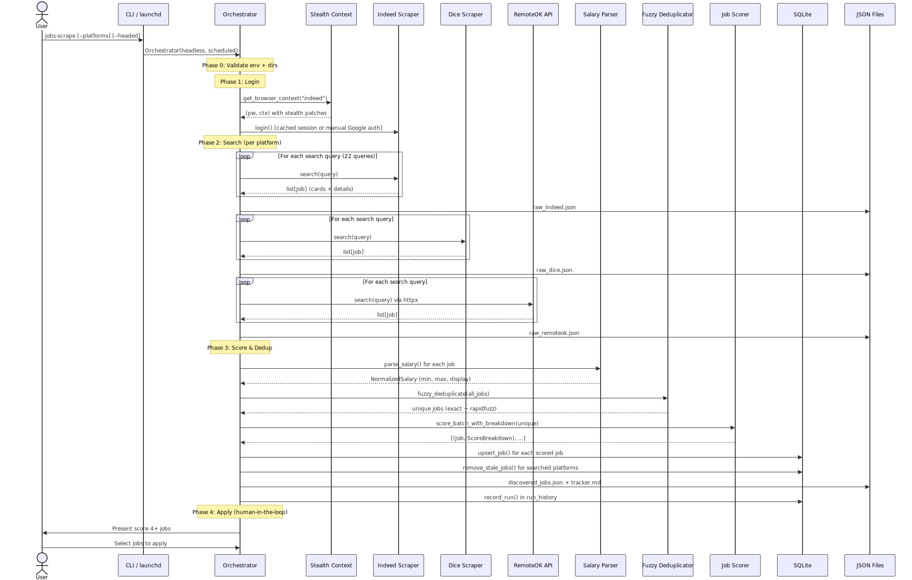
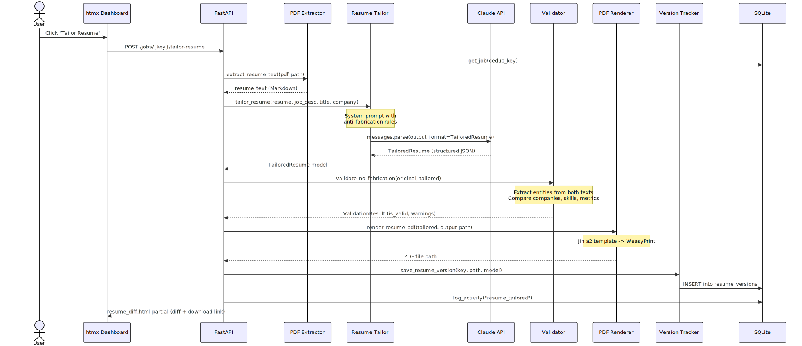

# JobFlow - Visual Architecture Documentation

## Executive Summary

JobFlow is a Python application that automates the job search lifecycle across three platforms (Indeed, Dice, RemoteOK). The architecture follows a clean pipeline pattern: a **5-phase Orchestrator** coordinates platform-specific scrapers (Playwright for browser automation, httpx for APIs), runs jobs through a weighted scoring engine, persists everything in SQLite, and surfaces results through a FastAPI/htmx dashboard with real-time SSE. AI integration via Anthropic's Claude API handles resume tailoring and cover letter generation with a 3-layer anti-fabrication system. A macOS launchd scheduler enables daily unattended runs. The codebase uses Protocol-based polymorphism with a decorator registry for platforms, making it straightforward to add new job boards.

### Bird's Eye View



Source: [01-birds-eye-view.mmd](./diagrams/01-birds-eye-view.mmd)

---

## Phase 2: High-Level Architecture

The system operates in two distinct modes: **pipeline mode** (CLI/scheduled) for job discovery and scoring, and **dashboard mode** (FastAPI) for human interaction, AI generation, and application submission.


Source: [02-high-level-architecture.mmd](./diagrams/02-high-level-architecture.mmd)

**Key Insights:**

- Two operational modes share the same data layer (SQLite) -- pipeline writes, dashboard reads/writes
- Browser platforms (Indeed, Dice) use persistent contexts with `playwright-stealth` for anti-detection
- The Apply Engine bridges async FastAPI with synchronous Playwright via `threading.Event` + `asyncio.Queue`
- AI features (resume/cover letter) are lazy-imported -- the dashboard works without `ANTHROPIC_API_KEY`

---

## Phase 3: Directory & Module Map


Source: [03-directory-module-map.mmd](./diagrams/03-directory-module-map.mmd)

**Key Insights:**

- `webapp/db.py` (723L) and `webapp/app.py` (712L) are the two largest files -- candidates for splitting
- Selector files (`indeed_selectors.py`, `dice_selectors.py`) are properly isolated from scraper logic
- The `resume_ai/` package has 7 modules implementing a full document generation pipeline
- No test files exist anywhere in the project

---

## Phase 4: Component Dependency Graph


Source: [04-component-dependency-graph.mmd](./diagrams/04-component-dependency-graph.mmd)

**Key Insights:**

- **No circular dependencies** -- the import chain is clean: `models` -> `protocols` -> `registry` -> platforms
- **Three high fan-in modules** act as foundation: `models.py`, `config.py`, `webapp/db.py`
- **Three orchestrators** with high fan-out: `orchestrator.py`, `webapp/app.py`, `apply_engine/engine.py`
- AI modules use **lazy imports** from `app.py` to avoid loading Anthropic SDK at startup

---

## Phase 5: Data Flow Diagrams

### Flow 1: Job Discovery Pipeline



Source: [05-job-discovery-pipeline.mmd](./diagrams/05-job-discovery-pipeline.mmd)

### Flow 2: Dashboard Apply Pipeline


Source: [06-dashboard-apply-pipeline.mmd](./diagrams/06-dashboard-apply-pipeline.mmd)

### Flow 3: AI Resume Tailoring



Source: [07-ai-resume-tailoring.mmd](./diagrams/07-ai-resume-tailoring.mmd)

**Key Insights:**

- The pipeline processes 22 search queries x 3 platforms per run -- potentially hundreds of raw jobs
- The Apply Engine uses a background thread (`asyncio.to_thread`) bridged to FastAPI via `call_soon_threadsafe`
- Resume tailoring has 3 anti-fabrication layers: prompt constraints, structured output schema, post-generation validation

---

## Phase 6: Scraper Architecture



Source: [08-scraper-architecture.mmd](./diagrams/08-scraper-architecture.mmd)

**Key Insights:**

- The `@register_platform` decorator validates protocol compliance **at import time** -- missing methods cause `TypeError` immediately
- Platform auto-discovery scans `platforms/` and imports any module not in the infrastructure set (protocols, registry, mixins, stealth, *_selectors)
- Selectors are isolated in dedicated files -- when Indeed/Dice change their DOM, only one file needs updating
- Indeed has the highest anti-bot complexity: Cloudflare Turnstile, sponsored card filtering, 404 detection for bogus job IDs

---

## Phase 7: Scoring & Matching System


Source: [09-scoring-matching.mmd](./diagrams/09-scoring-matching.mmd)

**Key Insights:**

- Scoring is purely rule-based (no AI) -- fast and deterministic
- Tech matching uses simple `keyword in text` -- effective but case-sensitive for compound terms like "AI/ML"
- Score breakdowns are persisted to SQLite as JSON, enabling the dashboard to show why each job scored as it did
- Weights are configurable via `config.yaml` -- users can tune the scoring emphasis

---

## Phase 8: API Surface Map



Source: [10-api-surface-map.mmd](./diagrams/10-api-surface-map.mmd)

**Key Insights:**

- 20 endpoints total: 7 page routes, 4 job actions, 4 AI routes, 4 apply engine routes, 1 import
- All dashboard updates use htmx partials -- no full-page reloads for status changes, notes, or search
- The SSE apply stream uses `sse-starlette` with event types: progress, awaiting_confirm, confirmed, error, done, ping
- No authentication middleware -- the dashboard is designed for single-user localhost-only access

---

## Phase 9: Database Schema


Source: [11-database-schema.mmd](./diagrams/11-database-schema.mmd)

**Key Insights:**

- **Schema version 6** with a migration system that handles `ALTER TABLE` idempotently
- FTS5 virtual table enables full-text search with prefix matching across title, company, and description
- Three triggers keep the FTS5 index in sync with the jobs table (INSERT, UPDATE, DELETE)
- The `dedup_key` (PK) is `company::title` normalized -- cross-platform dedup is built into the schema
- Delta tracking via `first_seen_at` / `last_seen_at` enables stale job removal after each pipeline run

---

## Phase 10: Scheduler & Infrastructure


Source: [12-scheduler-infrastructure.mmd](./diagrams/12-scheduler-infrastructure.mmd)

**Key Insights:**

- The scheduler generates a macOS-specific launchd plist -- not portable to Linux/Windows
- `--scheduled` mode is "unattended": headless, no `input()` prompts, raises `RuntimeError` on CAPTCHA/verification
- Run history is recorded even on crash (in the `finally` block) with status: success/partial/failed
- Log files go to `job_pipeline/logs/` -- configurable via the plist

---

## Phase 11: AI Integration Map



Source: [13-ai-integration-map.mmd](./diagrams/13-ai-integration-map.mmd)

**Key Insights:**

- 3-layer anti-fabrication: prompt constraints -> Pydantic schema enforcement -> post-generation entity comparison
- Uses Anthropic's `messages.parse()` for structured output (not JSON mode) -- Pydantic models define the schema
- Temperature 0 for resumes (deterministic), 0.3 for cover letters (slight creativity)
- The validator checks 170+ known tech keywords and uses regex to extract companies, metrics, and percentages

---

## Phase 12: Codebase Health Dashboard

| Category | Status | Details |
| --- | --- | --- |
| **Code Organization** | ✅ | Clean layering: models -> protocols -> registry -> platforms. No circular deps. Proper separation of concerns across 5 packages. |
| **Dependency Management** | ✅ | 23 runtime deps in `pyproject.toml` with version pins. `hatchling` build system. Dev deps (ruff, pyright, pytest). |
| **Test Coverage** | 🔴 | **No test files exist.** `testpaths = ["tests"]` configured in pyproject.toml but the directory doesn't exist. |
| **Type Safety** | 🟡 | `pyright` configured. Pydantic v2 models throughout. Some `type: ignore` comments for lazy init patterns. |
| **Linting** | ✅ | `ruff` configured with E/F/I/UP/B/SIM rules. `.ruff_cache` present (actively used). |
| **Documentation** | 🟡 | Excellent docstrings on all public APIs. Comprehensive CLAUDE.md. No standalone docs beyond README. |
| **Security: Credentials** | ✅ | `.env` for secrets, `.gitignore` prevents commits. `validate_platform_credentials()` checks before use. |
| **Security: Browser Sessions** | 🟡 | Persistent sessions stored in `browser_sessions/` (gitignored). No encryption at rest. Session theft = account access. |
| **Security: API Keys** | 🟡 | `ANTHROPIC_API_KEY` loaded via env. Lazy-imported -- dashboard works without it. No rate limiting or cost tracking. |
| **Security: Dashboard** | 🔴 | **No authentication** on FastAPI. Localhost-only binding mitigates risk, but no auth if port-forwarded. |
| **Technical Debt** | ✅ | Only 1 TODO/FIXME across the codebase. No legacy shims. No dead mounts. |
| **Error Handling** | ✅ | Screenshots on selector failure. Structured error types in ApplyEngine. `_run_errors` tracked and recorded. |
| **Portability** | 🟡 | macOS-specific scheduler (launchd). Browser stealth hardcoded to Chrome on macOS user-agent. |
| **File Size Distribution** | ✅ | Largest files: db.py (723L), app.py (712L), orchestrator.py (566L). All manageable. |

---

## Navigation Guide

| "Where do I..." | Location | Pattern |
| :--- | :--- | :--- |
| **Add a new job board scraper** | `platforms/new_platform.py` | Implement `BrowserPlatform` or `APIPlatform` protocol, add `@register_platform("name")` decorator. Auto-discovered on import. See `platforms/remoteok.py` for API template, `platforms/dice.py` for browser template. |
| **Modify the scoring algorithm** | `scorer.py:131` (`_compute` method) | Adjust factor methods (`_title_score`, `_tech_score`, `_location_score`, `_salary_score`). Update weights in `config.yaml` under `scoring.weights`. |
| **Add a new dashboard view** | `webapp/app.py` (new route) + `webapp/templates/` (new template) | Follow the pattern of `kanban.html` or `analytics.html`. Extend `base.html`. Use htmx for interactivity. |
| **Change the scheduling** | `config.yaml:115-120` (schedule section) + `scheduler.py` | Edit `schedule.enabled`, `hour`, `minute`, `weekdays`. Run `python scheduler.py install` to apply. |
| **Find the AI prompts** | `resume_ai/tailor.py:16` + `resume_ai/cover_letter.py:15` | `SYSTEM_PROMPT` constants with anti-fabrication rules. Model defaults at line 51 in each file. |
| **Add tests** | Create `tests/` directory | `pyproject.toml` already configures `testpaths = ["tests"]` with pytest. |
| **Manage configuration** | `config.yaml` (non-sensitive) + `.env` (credentials/profile) | See `config.py` for the `AppSettings` model that merges both sources via `pydantic-settings`. |
| **Update DOM selectors** | `platforms/indeed_selectors.py` or `platforms/dice_selectors.py` | Isolated selector dictionaries. Update values without touching scraper logic. |
| **Add new job status stages** | `models.py:9` (`JobStatus` enum) + `webapp/app.py:39` (STATUSES list) + `webapp/app.py:658` (KANBAN_STATUSES) | Add enum member, then add to the appropriate status list. Schema handles string values. |

---

## Recommendations

1. **Add test coverage (critical):** The codebase has zero tests despite `pytest` being configured. Priority targets: `scorer.py` (deterministic, easily testable), `dedup.py` (fuzzy matching edge cases), `salary.py` (multi-format parsing), and `config.py` (validation logic). The `JOBFLOW_TEST_DB=1` env var for in-memory SQLite is already built into `db.py`.

2. **Add dashboard authentication:** The FastAPI server has no auth. Even localhost-only, it's one `--host 0.0.0.0` away from network exposure. Add a simple API key or basic auth middleware -- FastAPI's `Depends()` with a single secret from `.env` would be minimal and effective.

3. **Extract `webapp/app.py` into route modules:** At 712 lines with 20 endpoints spanning 5 concerns (pages, job actions, AI generation, apply engine, exports), this file is ripe for splitting into a FastAPI `APIRouter` per domain: `routes/pages.py`, `routes/jobs.py`, `routes/ai.py`, `routes/apply.py`, `routes/export.py`.

4. ~~Remove the legacy `Config` class shim~~ -- **DONE.** Removed in technical debt cleanup (2026-02-08). All modules use `get_settings()` directly.

5. **Add AI cost tracking:** The Anthropic API calls in `resume_ai/tailor.py` and `resume_ai/cover_letter.py` have no token counting or cost estimation. Since each tailored resume costs ~$0.01-0.10, adding `response.usage.input_tokens` / `output_tokens` logging to the `resume_versions` table would provide visibility into AI spend per job application.

---

## Diagrams Index

All Mermaid diagrams live in `design/diagrams/` as standalone `.mmd` files (single source of truth). Pre-rendered SVGs are in `design/images/`.

**Re-render all diagrams after editing:**

```bash
for f in design/diagrams/*.mmd; do
  base=$(basename "$f" .mmd)
  npx @mermaid-js/mermaid-cli -i "$f" -o "design/images/$base.svg" --quiet
done
```

| # | Source (.mmd) | Rendered (.svg) | Phase | Description |
| --- | --- | --- | --- | --- |
| 01 | [01-birds-eye-view.mmd](./diagrams/01-birds-eye-view.mmd) | [SVG](./images/01-birds-eye-view.svg) | Overview | Top-level system components and data flow |
| 02 | [02-high-level-architecture.mmd](./diagrams/02-high-level-architecture.mmd) | [SVG](./images/02-high-level-architecture.svg) | Phase 2 | Full architecture with both pipeline and dashboard modes |
| 03 | [03-directory-module-map.mmd](./diagrams/03-directory-module-map.mmd) | [SVG](./images/03-directory-module-map.svg) | Phase 3 | File/module layout with line counts |
| 04 | [04-component-dependency-graph.mmd](./diagrams/04-component-dependency-graph.mmd) | [SVG](./images/04-component-dependency-graph.svg) | Phase 4 | Import dependencies and fan-in/fan-out analysis |
| 05 | [05-job-discovery-pipeline.mmd](./diagrams/05-job-discovery-pipeline.mmd) | [SVG](./images/05-job-discovery-pipeline.svg) | Phase 5 | Sequence: CLI search through scoring |
| 06 | [06-dashboard-apply-pipeline.mmd](./diagrams/06-dashboard-apply-pipeline.mmd) | [SVG](./images/06-dashboard-apply-pipeline.svg) | Phase 5 | Sequence: Dashboard apply with SSE |
| 07 | [07-ai-resume-tailoring.mmd](./diagrams/07-ai-resume-tailoring.mmd) | [SVG](./images/07-ai-resume-tailoring.svg) | Phase 5 | Sequence: Resume tailoring with validation |
| 08 | [08-scraper-architecture.mmd](./diagrams/08-scraper-architecture.mmd) | [SVG](./images/08-scraper-architecture.svg) | Phase 6 | Protocol/registry/adapter pattern |
| 09 | [09-scoring-matching.mmd](./diagrams/09-scoring-matching.mmd) | [SVG](./images/09-scoring-matching.svg) | Phase 7 | Weighted scoring factors and calculation |
| 10 | [10-api-surface-map.mmd](./diagrams/10-api-surface-map.mmd) | [SVG](./images/10-api-surface-map.svg) | Phase 8 | All 20 FastAPI endpoints grouped by concern |
| 11 | [11-database-schema.mmd](./diagrams/11-database-schema.mmd) | [SVG](./images/11-database-schema.svg) | Phase 9 | ER diagram: 4 tables + FTS5 |
| 12 | [12-scheduler-infrastructure.mmd](./diagrams/12-scheduler-infrastructure.mmd) | [SVG](./images/12-scheduler-infrastructure.svg) | Phase 10 | launchd plist generation and run flow |
| 13 | [13-ai-integration-map.mmd](./diagrams/13-ai-integration-map.mmd) | [SVG](./images/13-ai-integration-map.svg) | Phase 11 | 3-layer anti-fabrication pipeline |

---

## Color Legend

| Color | Hex | Represents |
| :--- | :--- | :--- |
| Blue | `#4A90D9` | Dashboard / FastAPI |
| Purple | `#7B68EE` | Scrapers / Playwright |
| Orange | `#E67E22` | Database / SQLite |
| Gray | `#95A5A6` | External job boards |
| Green | `#27AE60` | Scheduler / Infrastructure / Config |
| Yellow | `#F39C12` | Utilities / Processing / Shared |
| Teal | `#1ABC9C` | Tests |
| Pink | `#E91E63` | AI services |
| Red | `#E74C3C` | Core / High fan-in modules |
| Light Blue | `#3498DB` | User interaction points |
